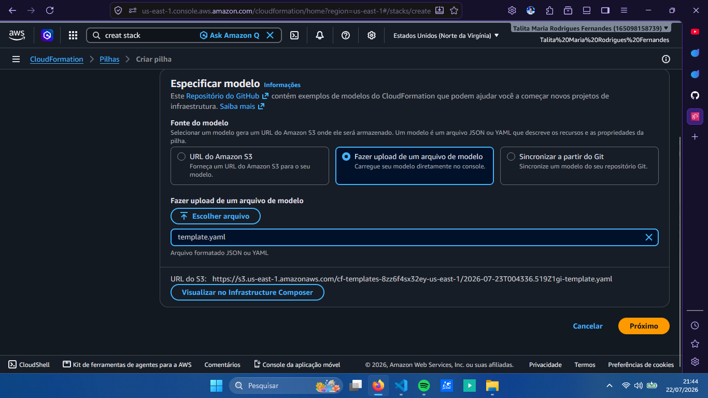
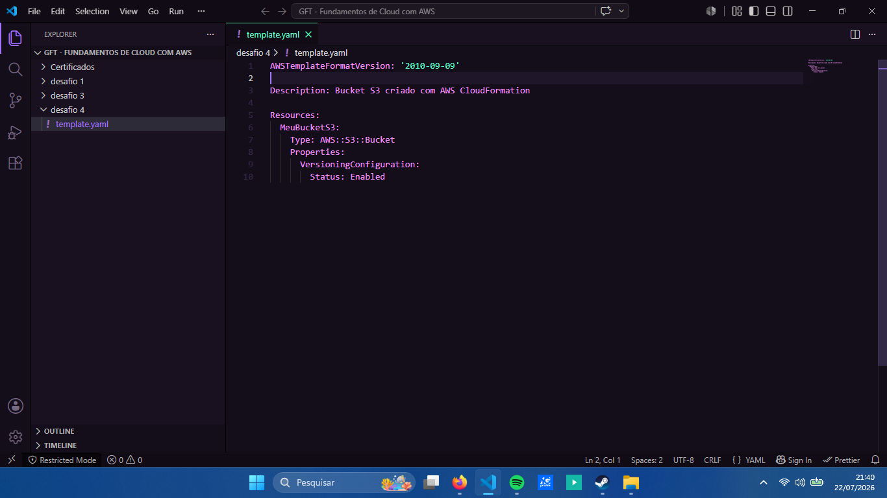
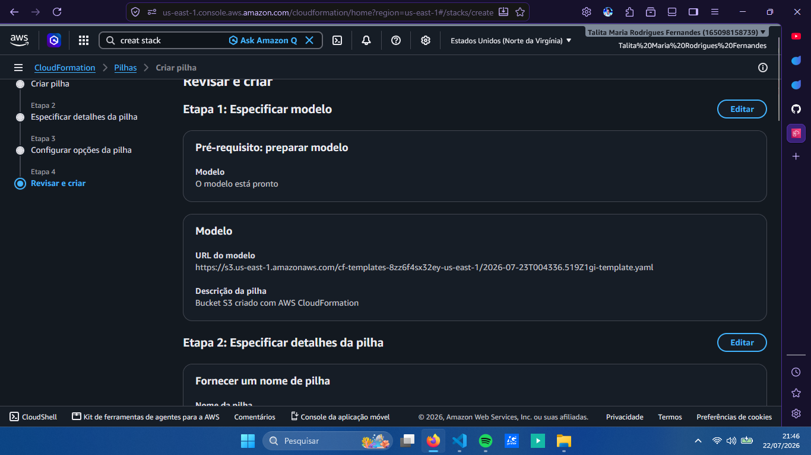
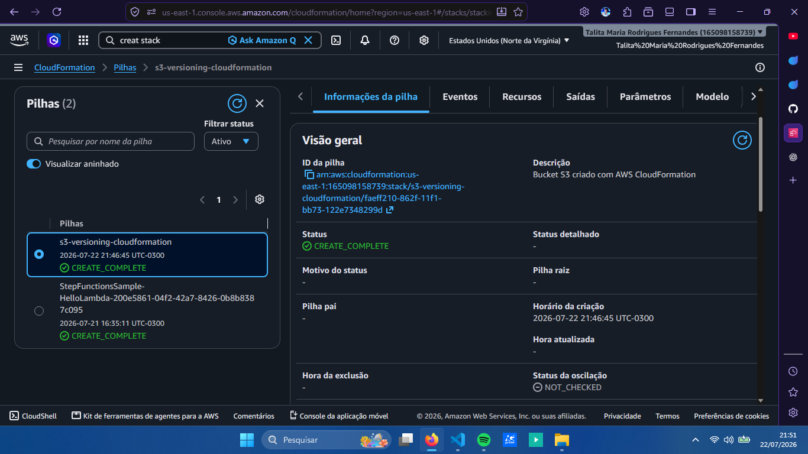

# ☁️ AWS CloudFormation: Provisionamento de Bucket S3

## 📖 Sobre o projeto

Este repositório foi desenvolvido como parte de um laboratório prático sobre **AWS CloudFormation** e **Infrastructure as Code (IaC)**.

O objetivo da prática foi criar uma infraestrutura utilizando um template YAML, permitindo que um bucket Amazon S3 fosse provisionado automaticamente por meio de uma Stack do CloudFormation.

---

## 🎯 Objetivos

- Compreender o funcionamento do AWS CloudFormation;
- Criar um template utilizando YAML;
- Provisionar um bucket Amazon S3 através de Infrastructure as Code;
- Habilitar o versionamento do bucket;
- Acompanhar o processo de criação e gerenciamento de uma Stack.

---

## 🛠️ Serviços e tecnologias utilizados

- **AWS CloudFormation**
- **Amazon S3**
- **YAML**
- **Infrastructure as Code (IaC)**
- 
---

## 🚀 Processo realizado

### 1. Upload do template

O arquivo YAML foi carregado no AWS CloudFormation para iniciar a criação da Stack.

---

### 2. Template desenvolvido

O template define o bucket S3 e configura o versionamento como habilitado.

---

### 3. Revisão da Stack

Antes da criação, foi realizada a revisão das configurações da Stack e dos recursos que seriam provisionados.

---

### 4. Stack criada com sucesso

Após a implantação, a Stack foi criada com sucesso, provisionando o bucket S3 definido no template.

---

## 💡 Aprendizados

Durante esta prática, pude compreender como o AWS CloudFormation permite definir e provisionar recursos de infraestrutura por meio de código.

A utilização de um template YAML torna o processo de criação mais organizado e reproduzível, permitindo que os recursos sejam gerenciados de forma declarativa através de uma Stack.

Também foi possível compreender na prática a aplicação do conceito de **Infrastructure as Code (IaC)** utilizando um bucket Amazon S3 como recurso.

---

## ✅ Conclusão

A prática demonstrou como o AWS CloudFormation pode simplificar o provisionamento de recursos na AWS por meio de templates.

Ao criar um bucket S3 com versionamento utilizando um arquivo YAML, foi possível aplicar os conceitos de Infrastructure as Code e compreender melhor como a AWS permite automatizar e gerenciar sua infraestrutura.

---
**Talita Maria Rodrigues Fernandes**

Projeto desenvolvido durante o Bootcamp da DIO 🚀
